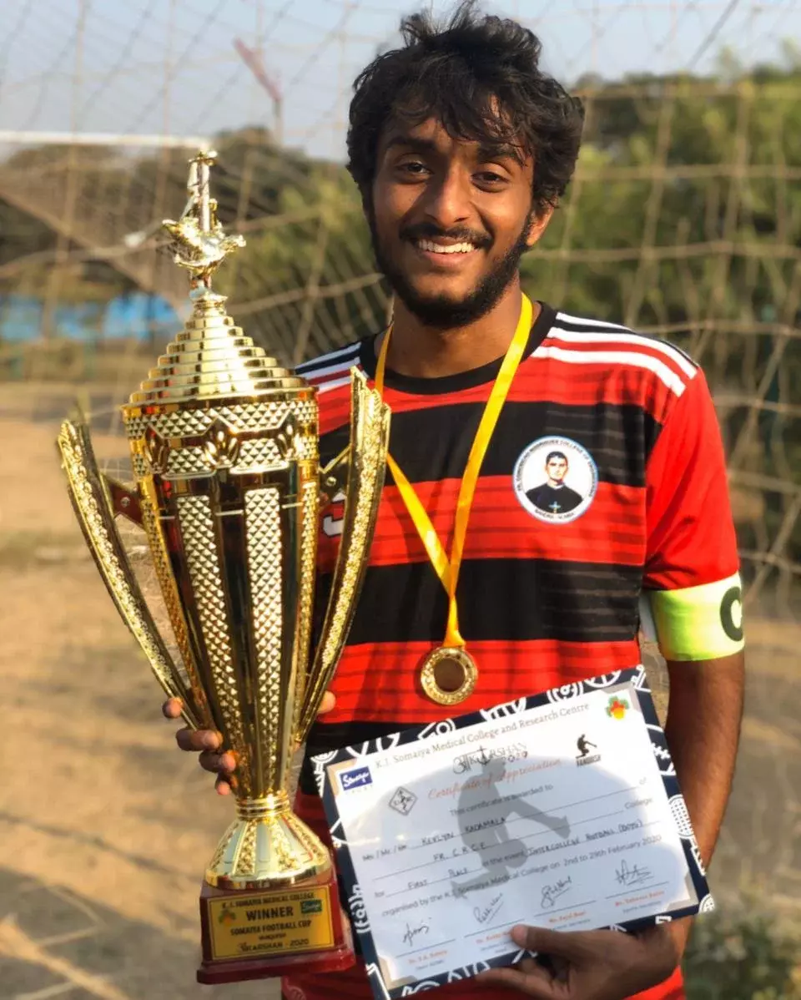

## Smart India Hackathon

<h4>Winner</h4>
<h5>AUGUST 2020</h5>

The problem statement was to develop an IOT-based Advance Public Address and Flood Warning Systems for all Hydro Power projects across India. We built a solution that used latest technology both in the software and hardware domains to create an end-to-end system that provided alerts and warnings on every possible platform/medium.

## SPIT Hackathon

<h4>1st Place</h4>
<h5>FEBRUARY 2020</h5>

Our topic was: Malware Detection using ML Techniques. We built a framework that reads dll files and detects whether the file is malware or goodware. You can read more about the hackathon <a href="https://spark.spit.ac.in/csi-s-p-i-t-hackathon-2020/" target="_blank">here</a>.

## DMCE Hackathon

<h4>2nd Place</h4>
<h5>JANUARY 2020</h5>

Our topic was: Tackle/Track/Diagnose mental health issues using CBT and AI/ML. Our solution involved making a chatbot that detected the user emotion and we provided help using CBT techniques. We also provided a diary/journal for the user to write down their thoughts. We performed sentiment analysis on this and provided the user with feedback regarding his daily thoughts. Other functionalities such as nearby hospitals and calling emergency contacts for help was also provided.

## VCET Hackathon

<h4>1st Place</h4>
<h5>SEPTEMBER 2019</h5>

Our topic was: Application for Depression Detection. We built a mobile application that connected to Twitter and performed sentiment analysis over the users tweets. We graphed these results using historical data that was stored into Firebase.

## Tata-Symbiosis Hackathon

<h4>4th Place</h4>
<h5>SEPTEMBER 2019</h5>

Our topic was: Intent Classification based on audio clips. We used Google's Speech-to-Text to convert the voice clips into text. We trained the OpenNMT model to translate Marathi into English to carry out our intent classification task. Though we did not win top 3, this was my first national hackathon and I am proud to say we finished 4th from more than 400 teams.

---

*I've also participated in many other hackathons and coding competitions! But these are the ones I found success in :)*

*Hardwork never fails :D*
