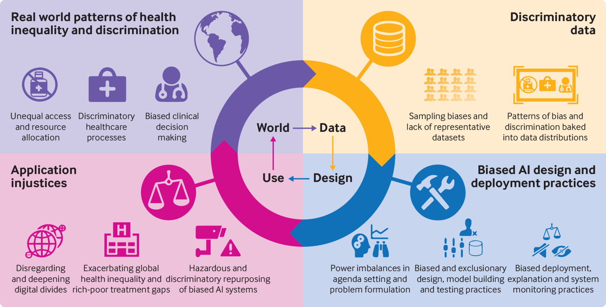

Humans write algorithms and code that run on data collected from the
real world. Together, they may mimic or exaggerate any preexisting bias.
This is what we call Algorithmic Bias. We could try to avoid collecting
data that segregate people based on their gender, race or religion. But,
they may still materialize as correlated features. For example,
purchasing records could correlate to gender and zip codes could
correlate to race. Bias could also arise due to the lack of relevant
data. For example, in the famous dataset - “Labeled Faces in the Wild”
[[1]](#1) 83.5% of images are of white people [[2]](#2). It also contains a
limited number of children, no babies, very few adults above the age of
80, and a small proportion of women. It also states that several
ethnicities have very little or no representation at all. The creators
of the LFW dataset mention that the dataset is not meant for commercial
applications. But are companies active in trying to identify any
pre-existing biases in their datasets? Are they aware of how their
algorithms interact with society? Algorithmic systems shape our lives,
influencing our opportunities in employment, education and finance. The
data that we unknowingly provide them with often fuel these systems.
This has been the source of the flame that has destroyed so many
innocent lives.

In 2016, ProPublica published its analysis of COMPAS (Correctional
Offender Management Profiling for Alternative Sanctions). This was an
algorithm that not only assesses the risk of committing a crime in the
future but also around two dozen so-called “criminogenic needs”. It
ranks the defendants either as low, medium or high risk in each category
[[3]](#3). The algorithm predicted that blacks are twice as likely as whites
to be labelled a higher risk and not re-offend. But it would make the
opposite mistake among whites. They were more likely labelled to be
lower risk but go on and commit more crimes.

<figure>
<figcaption style="text-align: center" aria-hidden="true">Black Defendants’ Risk Scores</figcaption>
</figure>

<figure>
<figcaption style="text-align: center" aria-hidden="true">White Defendants’ Risk Scores</figcaption>
</figure>

In 2018, researchers conducted a study with Convolution Neural Networks
(CNN). It detected potentially cancerous skin lesions better than the
study group that included 58 dermatologists. Yet, the data used to train
the CNN came from fair-skinned populations in the US, Australia and
Europe. As a result, people of colour could either be misdiagnosed with
nonexistent skin cancers or they could be completely missed [[4]](#4). In
2019, Facebook was sued for letting advertisers target their ads based
on race, gender and religion. It included postings for preschool
teachers and secretaries which they showed to a higher fraction of
women. And, they showed postings for janitors and taxi drivers to a
higher proportion of minorities. White users were shown more ads on home
sales, while minorities were shown ads for rentals [[5]](#5). The way these
systems are established, create a positive feedback loop. Every
incorrect prediction, every false sentencing and every targeted
advertisement adds another data point to the already biased system.

<figure>
<figcaption style="text-align: center" aria-hidden="true">The cascading effect of AI.
 
Image source: The British Medical Journal <a href="#6">[6]</a></figcaption>
</figure>

The first step that we as developers can take is understanding our
responsibility. A study was conducted in 2019 where one on one
interviews were conducted with around 35 ML practitioners. Most of the
interviewees reported that their teams do not have any protocols in
place to support the collection and curation of a balanced or
representative dataset. Often these teams do not discover serious
fairness issues until they receive customer feedback [[7]](#7). A biased
society often leads to a biased AI, and programmers are merely a part of
society. This same AI that we use so often, is developed by human
programmers. Hence, we must recognize our own biases to avoid
incorporating them into the AI systems that we develop. So, how can we
combat algorithmic bias? There has been a lot of discussion around the
power of open source and its communities. We could find great potential
in its technologies and methodologies in the fight against algorithmic
bias. We have AI research labs from companies like Google (Google Brain)
and Facebook (Facebook AI Research) working on open-sourced Deep
Learning libraries like Tensorflow and PyTorch respectively. These
libraries along with Scikit-learn, SciPy, spaCy etc. already dominate
modern AI. Open source is not only effective in software, but also for
curating large datasets. We have platforms like Kaggle and CodaLab where
individuals, organisations or companies publish their datasets to obtain
a community-sourced solution. This also enables and encourages discourse
on any existing bias. Openness will lead to awareness. It would only
educate those unaware of algorithmic bias and help them understand its
implications.

<figure>
<figcaption style="text-align: center" aria-hidden="true">Some publicly available dataset sources.
 
Image source: Great Learning <a href="#8">[8]</a></figcaption>
</figure>

We have to recognize that issues regarding algorithmic fairness usually
cannot be foreseen or detected before launch [[9]](#9). It often includes
hindsight, and though wonderful, we need to identify any existing biases
before causing any catastrophic damage. There might not be one solution
that solves all problems. But the important point to keep in mind is
that we will have problems to solve. There have been communities
established for fairness, accountability and transparency (FAT ML
[[10]](#10)). Tools are being developed to help us understand our data better
(Know Your Data [[11]](#11)). Important metrics are being included to
evaluate fairness and mitigate any bias in trained models (AllenNLP
[[12]](#12), [[13]](#13) and Fairlearn [[14]](#14)). These steps are necessary to
ensure that we incorporate equity into our AI systems to prevent it from
amplifying inequalities.

While we all strive for equality, equity, fairness, justice, sometimes,
it is not enough. Sometimes we need to be biased to ensure a level
playing field for everyone. For example, the selective public schools of
New York. A New York Times article released an article titled, “Only 7
Black Students Got Into Stuyvesant, N.Y.’s Most Selective High School,
Out of 895 Spots,”. Eight of the nine specialized high schools require
applicants to undergo the Specialized High Schools Admissions Test
(SHSAT). The main problem is not that Black and Hispanic students
neglect to give the SHSAT, even though they comprise the majority of
students taking the test, they are disproportionately denied admission
into these specialized schools. Another fact of the matter is that
despite applying to these schools and taking entrance exams, children of
colour do not attend middle schools that funnel students into
specialized schools [[15]](#15). Here is another article that explains how
racism affects children of colour in public schools [[16]](#16).

Many questions arise from this unfortunate situation. Could we find
another way to fight this bias by working on an “anti-bias algorithm”?
Could an algorithm be trained on biased data, where it manages to
identify and disregard the bias? While these are hypotheticals, one
thing is certain is that if we have to integrate AI into society, we
have to keep algorithmic fairness in mind. But while algorithms and data
is one thing, addressing social and political themes are another problem
that we as a society have to solve.

## References

[1] G. B. Huang, M. Ramesh, T. Berg, and E. Learned-Miller, “Labeled Faces in the Wild: A Database for Studying Face Recognition in Unconstrained Environments,” Tech. Rep. 07-49, University of Massachusetts, Amherst, October 2007.

  

[2] “Why Racial Bias is Prevalent in Facial Recognition Technology.” <a target="_blank" href="http://jolt.law.harvard.edu/digest/why-racial-bias-is-prevalent-in-facial-recognition-technology">http://jolt.law.harvard.edu/digest/why-racial-bias-is-prevalent-in-facial-recognition-technology</a>. Accessed: 20th December 2021.

  

[3] “Machine Bias.” <a target="_blank" href="https://www.propublica.org/article/machine-bias-risk-assessments-in-criminal-sentencing">https://www.propublica.org/article/machine-bias-risk-assessments-in-criminal-sentencing</a>. Accessed: 20th December 2021.

  

[4] A. Lashbrook, “AI-Driven Dermatology Could Leave Dark-Skinned Patients Be-
hind.” <a target="_blank" href="https://www.theatlantic.com/health/archive/2018/08/machine-learning-dermatology-skin-color/567619/">https://www.theatlantic.com/health/archive/2018/08/machine-learning-dermatology-skin-color/567619/</a>, Aug 2018. Accessed: 20th December 2021.

  

[5] “Facebook’s ad-serving algorithm discriminates by gender and race.” <a target="_blank" href="https://www.technologyreview.com/2019/04/05/1175/facebook-algorithm-discriminates-ai-bias/">https://www.technologyreview.com/2019/04/05/1175/facebook-algorithm-discriminates-ai-bias/</a>. Accessed: 20th December 2021.

  

[6] D. Leslie, A. Mazumder, A. Peppin, M. K. Wolters, and A. Hagerty, “Does “AI” stand for augmenting inequality in the era of covid-19 healthcare?,” BMJ, vol. 372, p. n304, March 2021.

  

[7] K. Holstein, J. Wortman Vaughan, H. Daumé, M. Dudik, and H. Wallach, “Improving Fairness in Machine Learning Systems: What Do Industry Practitioners Need?,” in Proceedings of the 2019 CHI Conference on Human Factors in Computing Systems, p. 1–16, ACM, May 2019.

  

[8] “Great Learning.” <a target="_blank" href="https://www.mygreatlearning.com/blog/sources-for-analytics-and-machine-learning-datasets/">https://www.mygreatlearning.com/blog/sources-for-analytics-and-machine-learning-datasets/</a>. Accessed: 5th January 2022.

  

[9] A. Woodruff, “10 things you should know about algorithmic fairness,” Interactions, vol. 26, p. 47–51, Jun 2019.

  

[10] “Fairness, Accountability, and Transparency in Machine Learning.” <a target="_blank" href="https://www.fatml.org/">https://www.fatml.org/</a>. Accessed: 4th January 2022.

  

[11] T. P. t. Google, “Know Your Data.” <a target="_blank" href="https://knowyourdata.withgoogle.com">https://knowyourdata.withgoogle.com</a>. Accessed: 4th January 2022.

  

[12] “Fairness and Bias Mitigation · A Guide to Natural Language Processing With AllenNLP.” <a target="_blank" href="https://guide.allennlp.org/fairness/">https://guide.allennlp.org/fairness/</a>. Accessed: 4th January 2022.

  

[13] “Fairness Metrics Allen NLP Documentation.” <a target="_blank" href="https://docs.allennlp.org/main/api/fairness/fairness_metrics/">https://docs.allennlp.org/main/api/fairness/fairness_metrics/</a>. Accessed: 4th January 2022.

  

[14] “Fairlearn.” <a target="_blank" href="https://fairlearn.org/">https://fairlearn.org/</a>. Accessed: 4th January 2022.

  

[15] “Why New York City’s Selective Public High Schools Are Neglecting to Reflect the City’s Actual Diversity.” <a target="_blank" href="https://raceandschools.barnard.edu/selectivehighschools/rita-2/">https://raceandschools.barnard.edu/selectivehighschools/rita-2/</a>. Accessed: 4th January 2022.

  

[16] “How Racism Affects Children of Color in Public Schools.” <a target="_blank" href="https://www.thoughtco.com/how-racism-affects-public-school-minorities-4025361">https://www.thoughtco.com/how-racism-affects-public-school-minorities-4025361</a>. Accessed: 4th January 2022.

  

[17] V. Warmerdam, “koaning.io: Naive Bias[tm] and Fairness Tooling.” <a target="_blank" href="https://koaning.io/posts/just-another-dangerous-situation/">https://koaning.io/posts/just-another-dangerous-situation/</a>, 2021.

  

[18] CrashCourse, “Algorithmic Bias and Fairness: Crash Course AI #18.” <a target="_blank" href="https://www.youtube.com/watch?v=gV0_raKR2UQ">https://www.youtube.com/watch?v=gV0_raKR2UQ</a>, 2019. Accessed: 20th December 2021.

  

[19] V. Eubanks, “The Digital Poorhouse: Embracing habit in an automated world,” Harper’s Magazine, vol. January 2018, Jan 2018. Accessed: 20th December 2021.

  

[20] J. Sherman, “AI and machine learning bias has dangerous implications.” <a target="_blank" href="https://opensource.com/article/18/1/how-open-source-can-fight-algorithmic-bias">https://opensource.com/article/18/1/how-open-source-can-fight-algorithmic-bias</a>. Accessed: 20th December 2021.

  

[21] “Bias in machine learning: How to measure fairness in algorithms?” <a target="_blank" href="https://www.trilateralresearch.com/bias-in-machine-learning-how-to-measure-fairness-in-algorithms/">https://www.trilateralresearch.com/bias-in-machine-learning-how-to-measure-fairness-in-algorithms/</a>. Accessed: 4th January 2022.

Photo by <a href="https://unsplash.com/@markusspiske?utm_source=unsplash&utm_medium=referral&utm_content=creditCopyText">Markus Spiske</a> on <a href="https://unsplash.com/s/photos/algorithm?utm_source=unsplash&utm_medium=referral&utm_content=creditCopyText">Unsplash</a>

